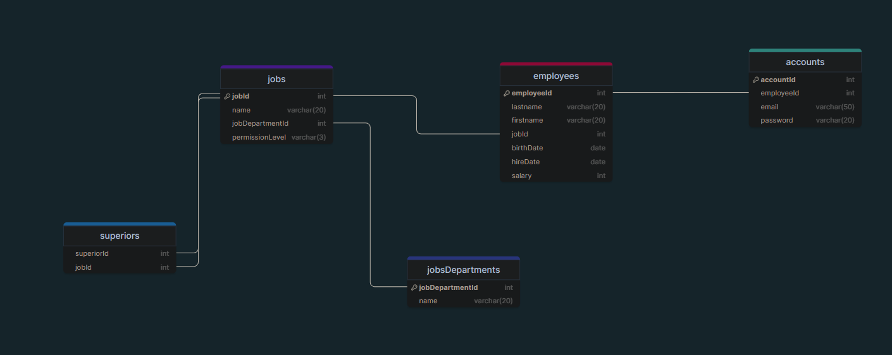

# **SITE EMPLOYEE MANAGEMENT**

## DESCRIPTION:
*This website is our final project of SQL module. The goal is to create a tool that allows a company to manage its employees in the best possible way!*

## DEPENDENCY:
- Need NodeJS for this project ! (LTS)

## DATABASE LOCATION:
The database file is in: `webserver/controllers/company.db`.
The queries for create the database is in the file: `dbCreation.sql`.

## RUN PROJECT

    cd Client/
    npm i 
    npm run dev 

    cd webserver/
    npm i 
    npm start

    http://localhost:5173/ Website
    http://localhost:3001/ API

## DB Organization

## HOW TO CONNECT:
Log in with :
- **One of an account:**
    - **Login:** *jean.dupont@email.com*
    - **Password:** *password123*
- *Jean Dupont is the general director of this fictive society.*
- **To create an account you need to add an employee!**
- **The password is random, imagine is sending it in an email.**

## MEMBERS:
- Evan Ferron as `evanferron`
- Kevin Chaffaux as `NockIA`
- Sacha Sorgiati as `JellyPh1sh`
